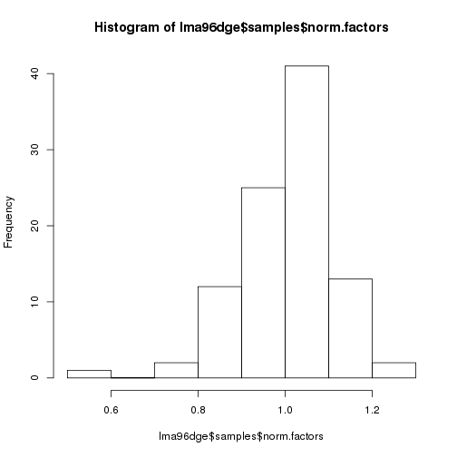
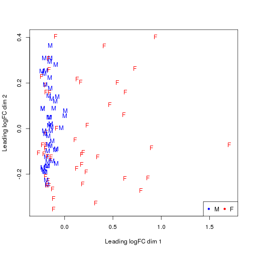
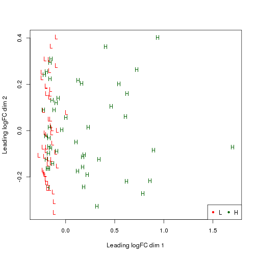
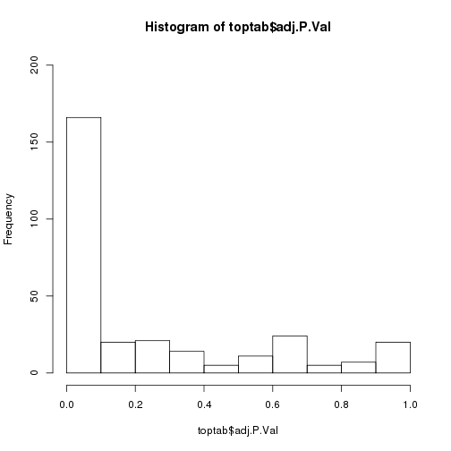

**Script:** `2_lma96_voom_de_analysis.R`

**Directory of Code:**  `/mnt/research/pigeqtl/analyses/microRNA/4_lma_de_analysis/scripts`

**Date:**  11/08/16; 11/14/16

**Input File Directory:**  

1. `/mnt/research/pigeqtl/analyses/microRNA/4_lma_de_analysis`

**Input File(s):**

1. `1_lma96_rounded_mean_mature_mirna_expression.Rdata`
2. `3_lma96_mature_mirna_annotation.Rdata`

**Output File Directory:** 

1. `/mnt/research/pigeqtl/analyses/microRNA/4_lma_de_analysis/`

**Output File(s):** 

1. `4_lma96_dge_object_design_mx.Rdata`
2. `5_lma96_voom_de_analysis_results.Rdata`

**Table of contents:**

1. [Objectives](#objectives)
2. [Install libraries](#install-libraries)
3. [Load data](#load-data)
4. [Analysis](#analysis)
5. [Save data](#save-data)
## Objectives
The objective of this script is to conduct a differential expression analysis of the 96 animals selected for loin muscle area (LMA) extremes.
This analysis will utilize voom and the limma pipeline.

## Install libraries


```r
library(methods)
library(limma)
library(edgeR)
library(qvalue)

sessionInfo()
```

```
## R version 3.2.0 (2015-04-16)
## Platform: x86_64-unknown-linux-gnu (64-bit)
## Running under: CentOS release 6.6 (Final)
## 
## locale:
##  [1] LC_CTYPE=en_US.UTF-8       LC_NUMERIC=C              
##  [3] LC_TIME=en_US.UTF-8        LC_COLLATE=en_US.UTF-8    
##  [5] LC_MONETARY=en_US.UTF-8    LC_MESSAGES=en_US.UTF-8   
##  [7] LC_PAPER=en_US.UTF-8       LC_NAME=C                 
##  [9] LC_ADDRESS=C               LC_TELEPHONE=C            
## [11] LC_MEASUREMENT=en_US.UTF-8 LC_IDENTIFICATION=C       
## 
## attached base packages:
## [1] methods   stats     graphics  grDevices utils     datasets  base     
## 
## other attached packages:
## [1] qvalue_2.2.2 edgeR_3.12.1 limma_3.26.9 knitr_1.14  
## 
## loaded via a namespace (and not attached):
##  [1] Rcpp_0.12.7      grid_3.2.0       plyr_1.8.4       gtable_0.2.0    
##  [5] magrittr_1.5     evaluate_0.9     scales_0.4.0     ggplot2_2.1.0   
##  [9] stringi_1.1.1    reshape2_1.4.1   splines_3.2.0    tools_3.2.0     
## [13] stringr_1.1.0    munsell_0.4.3    colorspace_1.2-6
```

## Load data


```r
rm(list=ls())

setwd("/mnt/research/pigeqtl/analyses/microRNA/4_lma_de_analysis/scripts/")
```

Load the miRNA count data, and covariate data


```r
load("../1_lma96_covar_rounded_mean_mature_mirna_expression.Rdata")
```

Load the mature miRNA annotation file


```r
load("../3_lma96_mature_mirna_annotation.Rdata")

ls()
```

```
## [1] "lma96.dfmeanrcround"       "lma96.total.mature.annot2"
## [3] "lmapigs"
```

## Analysis


```r
dim(lma96.dfmeanrcround)
```

```
## [1] 411  96
```

```r
head(lma96.dfmeanrcround)
```

```
##                1034  1036  1041  1049  1058  1060  1080  1082  1085  1091
## ssc-let-7a    48132 23427 28448 29860 40758 29750 38799 31460 29857 21333
## ssc-let-7c    32745 14987 18144 18681 34313 15294 28022 19512 16741 12522
## ssc-let-7d-3p   381   192   198   269   778   239   774   355   243   166
## ssc-let-7d-5p  4925  1938  2511  3076  3472  3276  3705  3301  3094  2068
## ssc-let-7e     2811  1302  1463  1690  2512  1410  2229  1577  1523   993
## ssc-let-7f    35432 16422 20162 22986 16512 24476 19175 22094 22426 16483
##                1096  1100  1107  1110  1111  1113  1116  1123  1134  1136
## ssc-let-7a    35977 21304 43336 46963 41826 41174 36678 45540 59997 34675
## ssc-let-7c    20772 12449 26354 28968 28788 29017 29022 31957 45232 23212
## ssc-let-7d-3p   440   182   389   503   514   449   710   460  1071   411
## ssc-let-7d-5p  3259  1873  5003  5616  4916  4470  3083  5035  6661  3659
## ssc-let-7e     1898   954  3130  3081  2900  2163  2069  2654  3942  2326
## ssc-let-7f    29076 15185 32137 36462 31452 29666 13446 34278 34402 25967
##                1145  1147  1152  1154  1158 1170  1177  1179  1192  1194
## ssc-let-7a    36866 34398 42057 49982 35410 2366 25974 41518 42680 30864
## ssc-let-7c    23731 21229 29962 37824 23684 3077 15389 28463 30503 17962
## ssc-let-7d-3p   356   330   319   750   449  525   339   378   393   256
## ssc-let-7d-5p  3756  3558  4141  5225  3845  175  2610  4251  4195  2588
## ssc-let-7e     2373  2205  2829  2481  2471   75  1345  2686  2324  1716
## ssc-let-7f    28076 27274 29414 29411 26172  576 20826 29466 29266 20800
##                1197  1199  1205  1207  1237  1239  1240  1242  1265  1267
## ssc-let-7a    44394 43819 38598 50950 46225 47411 35912 37383 24522 35894
## ssc-let-7c    31221 31310 25291 37902 32444 32430 24015 25399 14477 25063
## ssc-let-7d-3p   438   407   352   498   569   527   269   326   199   265
## ssc-let-7d-5p  4543  4655  3962  5754  5456  5398  3037  3840  2029  3507
## ssc-let-7e     2746  2749  2181  3820  3060  3045  1752  2440  1034  2036
## ssc-let-7f    31999 32016 28727 36304 34956 34056 27197 25904 20112 24842
##                1278  1282  1291  1295  1300  1304  1321  1323  1423  1424
## ssc-let-7a    15876 42837 36219 30672 28829 28805 24042 30292 25858 31424
## ssc-let-7c    14181 31924 24089 20474 21753 18148 14466 18737 16355 19779
## ssc-let-7d-3p  1033   365   261   268   652   195   209   203   183   236
## ssc-let-7d-5p  1356  4167  3663  3019  2545  2906  2304  2973  2427  3006
## ssc-let-7e      557  2730  2396  1674  1383  1900  1114  1508  1524  1782
## ssc-let-7f    10064 29654 25786 20982 18572 20946 18136 22222 19081 23174
##                1425  1426  1431  1434  1435  1444  1445  1449  1456  1458
## ssc-let-7a    10909 33168 23342 28218 17888 15044 16240 22696 13046 28524
## ssc-let-7c     5973 20260 14482 18147 10798  8526  9964 15666  7201 17704
## ssc-let-7d-3p    84   170   167   212   149    84   101   186    69   147
## ssc-let-7d-5p   826  3037  2314  2058  1582  1233  1421  1378  1004  2518
## ssc-let-7e      349  1968  1254  1413   977   665   728   935   494  1225
## ssc-let-7f     7665 24686 16910 20088 11720  9891 10624 16742  8510 20538
##                1482  1484  1491  1493  1502  1504  1510  1512  1517  1523
## ssc-let-7a    17197 32304 28680 37439 47522 42747 41810 20253 28069 47363
## ssc-let-7c     9342 24491 20807 26015 28812 26738 26126 17415 16928 34465
## ssc-let-7d-3p   116   566   308   379   383   536   323   979   264   506
## ssc-let-7d-5p  1635  2799  2618  3885  4754  4920  4554  1831  2821  4780
## ssc-let-7e      768  1786  1261  2065  3047  2534  2852   996  1365  2816
## ssc-let-7f    12142 12570 21874 27558 35356 32477 31694 10026 21929 35707
##                1529  1532  1533  1534  1537  1543  1578  1580  1589  1592
## ssc-let-7a    29313 26772 35966 27358 42022 44591 48268 35516 30704 37564
## ssc-let-7c    17004 15809 22883 16277 27810 31228 34068 25721 18956 24904
## ssc-let-7d-3p   254   161   310   180   487   507   460   492   252   345
## ssc-let-7d-5p  2946  2586  3729  2315  5000  5502  5521  3304  2918  3832
## ssc-let-7e     1496  1127  2030  1532  2639  2478  3076  1880  1578  2163
## ssc-let-7f    22302 19184 26026 20536 31470 34576 33807 19231 23504 27732
##                1593  1594  1625  1627  1638  1640  1644  1646  1652  1662
## ssc-let-7a    38084 36868 40084 35862 23068 37179 38866 29532 28213 39304
## ssc-let-7c    24512 22762 25993 24232 14980 19671 24475 18429 18530 25909
## ssc-let-7d-3p   369   334   502   292   214   271   306   317   249   417
## ssc-let-7d-5p  4164  3616  4835  3364  2023  3814  3651  2961  2957  3820
## ssc-let-7e     1887  2096  2469  2071  1160  2017  2711  1471  1670  2262
## ssc-let-7f    29918 27982 32046 24424 17376 30385 27878 22126 20542 29883
##                1669  1677  1685  1687  1695  1697
## ssc-let-7a    37340 33902 25400 28632 26621 23326
## ssc-let-7c    23004 20516 14806 15282 13519 13682
## ssc-let-7d-3p   405   265   295   170   293   245
## ssc-let-7d-5p  4027  3215  2537  2731  2630  2136
## ssc-let-7e     2314  1888  1126  1320  1291  1209
## ssc-let-7f    28316 25278 19161 21219 21408 17460
```

### 1. Create the dge object

First, ensure that the rownames are the same between the counts and annotation files:


```r
if (sum(rownames(lma96.dfmeanrcround)!=rownames(lma96.total.mature.annot2))!=0) stop ("rownames not equal between datasets")

lma96dge<-DGEList(counts=lma96.dfmeanrcround, genes=lma96.total.mature.annot2)
names(lma96dge)
```

```
## [1] "counts"  "samples" "genes"
```

```r
dim(lma96dge$counts)
```

```
## [1] 411  96
```

```r
head(lma96dge$counts)
```

```
##                1034  1036  1041  1049  1058  1060  1080  1082  1085  1091
## ssc-let-7a    48132 23427 28448 29860 40758 29750 38799 31460 29857 21333
## ssc-let-7c    32745 14987 18144 18681 34313 15294 28022 19512 16741 12522
## ssc-let-7d-3p   381   192   198   269   778   239   774   355   243   166
## ssc-let-7d-5p  4925  1938  2511  3076  3472  3276  3705  3301  3094  2068
## ssc-let-7e     2811  1302  1463  1690  2512  1410  2229  1577  1523   993
## ssc-let-7f    35432 16422 20162 22986 16512 24476 19175 22094 22426 16483
##                1096  1100  1107  1110  1111  1113  1116  1123  1134  1136
## ssc-let-7a    35977 21304 43336 46963 41826 41174 36678 45540 59997 34675
## ssc-let-7c    20772 12449 26354 28968 28788 29017 29022 31957 45232 23212
## ssc-let-7d-3p   440   182   389   503   514   449   710   460  1071   411
## ssc-let-7d-5p  3259  1873  5003  5616  4916  4470  3083  5035  6661  3659
## ssc-let-7e     1898   954  3130  3081  2900  2163  2069  2654  3942  2326
## ssc-let-7f    29076 15185 32137 36462 31452 29666 13446 34278 34402 25967
##                1145  1147  1152  1154  1158 1170  1177  1179  1192  1194
## ssc-let-7a    36866 34398 42057 49982 35410 2366 25974 41518 42680 30864
## ssc-let-7c    23731 21229 29962 37824 23684 3077 15389 28463 30503 17962
## ssc-let-7d-3p   356   330   319   750   449  525   339   378   393   256
## ssc-let-7d-5p  3756  3558  4141  5225  3845  175  2610  4251  4195  2588
## ssc-let-7e     2373  2205  2829  2481  2471   75  1345  2686  2324  1716
## ssc-let-7f    28076 27274 29414 29411 26172  576 20826 29466 29266 20800
##                1197  1199  1205  1207  1237  1239  1240  1242  1265  1267
## ssc-let-7a    44394 43819 38598 50950 46225 47411 35912 37383 24522 35894
## ssc-let-7c    31221 31310 25291 37902 32444 32430 24015 25399 14477 25063
## ssc-let-7d-3p   438   407   352   498   569   527   269   326   199   265
## ssc-let-7d-5p  4543  4655  3962  5754  5456  5398  3037  3840  2029  3507
## ssc-let-7e     2746  2749  2181  3820  3060  3045  1752  2440  1034  2036
## ssc-let-7f    31999 32016 28727 36304 34956 34056 27197 25904 20112 24842
##                1278  1282  1291  1295  1300  1304  1321  1323  1423  1424
## ssc-let-7a    15876 42837 36219 30672 28829 28805 24042 30292 25858 31424
## ssc-let-7c    14181 31924 24089 20474 21753 18148 14466 18737 16355 19779
## ssc-let-7d-3p  1033   365   261   268   652   195   209   203   183   236
## ssc-let-7d-5p  1356  4167  3663  3019  2545  2906  2304  2973  2427  3006
## ssc-let-7e      557  2730  2396  1674  1383  1900  1114  1508  1524  1782
## ssc-let-7f    10064 29654 25786 20982 18572 20946 18136 22222 19081 23174
##                1425  1426  1431  1434  1435  1444  1445  1449  1456  1458
## ssc-let-7a    10909 33168 23342 28218 17888 15044 16240 22696 13046 28524
## ssc-let-7c     5973 20260 14482 18147 10798  8526  9964 15666  7201 17704
## ssc-let-7d-3p    84   170   167   212   149    84   101   186    69   147
## ssc-let-7d-5p   826  3037  2314  2058  1582  1233  1421  1378  1004  2518
## ssc-let-7e      349  1968  1254  1413   977   665   728   935   494  1225
## ssc-let-7f     7665 24686 16910 20088 11720  9891 10624 16742  8510 20538
##                1482  1484  1491  1493  1502  1504  1510  1512  1517  1523
## ssc-let-7a    17197 32304 28680 37439 47522 42747 41810 20253 28069 47363
## ssc-let-7c     9342 24491 20807 26015 28812 26738 26126 17415 16928 34465
## ssc-let-7d-3p   116   566   308   379   383   536   323   979   264   506
## ssc-let-7d-5p  1635  2799  2618  3885  4754  4920  4554  1831  2821  4780
## ssc-let-7e      768  1786  1261  2065  3047  2534  2852   996  1365  2816
## ssc-let-7f    12142 12570 21874 27558 35356 32477 31694 10026 21929 35707
##                1529  1532  1533  1534  1537  1543  1578  1580  1589  1592
## ssc-let-7a    29313 26772 35966 27358 42022 44591 48268 35516 30704 37564
## ssc-let-7c    17004 15809 22883 16277 27810 31228 34068 25721 18956 24904
## ssc-let-7d-3p   254   161   310   180   487   507   460   492   252   345
## ssc-let-7d-5p  2946  2586  3729  2315  5000  5502  5521  3304  2918  3832
## ssc-let-7e     1496  1127  2030  1532  2639  2478  3076  1880  1578  2163
## ssc-let-7f    22302 19184 26026 20536 31470 34576 33807 19231 23504 27732
##                1593  1594  1625  1627  1638  1640  1644  1646  1652  1662
## ssc-let-7a    38084 36868 40084 35862 23068 37179 38866 29532 28213 39304
## ssc-let-7c    24512 22762 25993 24232 14980 19671 24475 18429 18530 25909
## ssc-let-7d-3p   369   334   502   292   214   271   306   317   249   417
## ssc-let-7d-5p  4164  3616  4835  3364  2023  3814  3651  2961  2957  3820
## ssc-let-7e     1887  2096  2469  2071  1160  2017  2711  1471  1670  2262
## ssc-let-7f    29918 27982 32046 24424 17376 30385 27878 22126 20542 29883
##                1669  1677  1685  1687  1695  1697
## ssc-let-7a    37340 33902 25400 28632 26621 23326
## ssc-let-7c    23004 20516 14806 15282 13519 13682
## ssc-let-7d-3p   405   265   295   170   293   245
## ssc-let-7d-5p  4027  3215  2537  2731  2630  2136
## ssc-let-7e     2314  1888  1126  1320  1291  1209
## ssc-let-7f    28316 25278 19161 21219 21408 17460
```

```r
lma96dge$samples
```

```
##      group lib.size norm.factors
## 1034     1  1462358            1
## 1036     1   830436            1
## 1041     1   944837            1
## 1049     1  1081483            1
## 1058     1  1257197            1
## 1060     1   927156            1
## 1080     1  1109738            1
## 1082     1   990323            1
## 1085     1   852353            1
## 1091     1   863508            1
## 1096     1  1182030            1
## 1100     1   830451            1
## 1107     1  1050193            1
## 1110     1  1342830            1
## 1111     1  1159315            1
## 1113     1  1283731            1
## 1116     1  1057987            1
## 1123     1  1220095            1
## 1134     1  1582559            1
## 1136     1  1180626            1
## 1145     1  1096048            1
## 1147     1  1140114            1
## 1152     1  1039437            1
## 1154     1  1476707            1
## 1158     1  1181559            1
## 1170     1   223934            1
## 1177     1   833767            1
## 1179     1  1177411            1
## 1192     1  1169859            1
## 1194     1   917965            1
## 1197     1  1223862            1
## 1199     1  1221941            1
## 1205     1  1135889            1
## 1207     1  1330391            1
## 1237     1  1216288            1
## 1239     1  1226939            1
## 1240     1  1133876            1
## 1242     1  1106331            1
## 1265     1  1026087            1
## 1267     1  1083244            1
## 1278     1   765335            1
## 1282     1  1148403            1
## 1291     1  1048540            1
## 1295     1   825476            1
## 1300     1   958081            1
## 1304     1   787747            1
## 1321     1   831072            1
## 1323     1   957291            1
## 1423     1   924680            1
## 1424     1   986389            1
## 1425     1   370977            1
## 1426     1   961236            1
## 1431     1   601375            1
## 1434     1   823729            1
## 1435     1   441436            1
## 1444     1   431056            1
## 1445     1   459058            1
## 1449     1   868625            1
## 1456     1   457313            1
## 1458     1   910724            1
## 1482     1   458465            1
## 1484     1  1069564            1
## 1491     1  1117506            1
## 1493     1  1064666            1
## 1502     1  1088339            1
## 1504     1  1111742            1
## 1510     1   944014            1
## 1512     1   650729            1
## 1517     1   855954            1
## 1523     1  1686058            1
## 1529     1   826453            1
## 1532     1   775138            1
## 1533     1  1033990            1
## 1534     1   700713            1
## 1537     1  1275728            1
## 1543     1  1239518            1
## 1578     1  1400041            1
## 1580     1   939869            1
## 1589     1  1004477            1
## 1592     1  1210756            1
## 1593     1  1173312            1
## 1594     1  1154715            1
## 1625     1  1086345            1
## 1627     1   987191            1
## 1638     1   872281            1
## 1640     1   887635            1
## 1644     1   787899            1
## 1646     1   931065            1
## 1652     1   890573            1
## 1662     1  1181022            1
## 1669     1  1079893            1
## 1677     1   960504            1
## 1685     1   818072            1
## 1687     1   710725            1
## 1695     1   765589            1
## 1697     1   816422            1
```

### 2. Filter the joint expression dataset (dge object)
First, eliminate miRNAs whose total expression is 0 among the datasets


```r
sum(rowSums(lma96dge$counts) == 0)
```

```
## [1] 79
```

So, 79 miRNAs have 0 expression, meaning 332 miRNAs remain


```r
lma96dge<-lma96dge[rowSums(lma96dge$counts)>0,]
dim(lma96dge)
```

```
## [1] 332  96
```

Calculate the read counts per million in order to filter miRNAs by normalized expression:


```r
cpm.lma96dge<-cpm(lma96dge)
dim(cpm.lma96dge)
```

```
## [1] 332  96
```

```r
cpm.lma96dge[1:5,1:5]
```

```
##                     1034       1036      1041       1049      1058
## ssc-let-7a    32913.9650 28210.4822 30108.897 27610.2352 32419.740
## ssc-let-7c    22391.9177 18047.1463 19203.312 17273.5031 27293.256
## ssc-let-7d-3p   260.5381   231.2038   209.560   248.7325   618.837
## ssc-let-7d-5p  3367.8484  2333.7139  2657.601  2844.2426  2761.699
## ssc-let-7e     1922.2379  1567.8511  1548.415  1562.6690  1998.096
```

Filter miRNAs with at least 1 cpm in at least 1/4 of the samples (96/4=24)


```r
filtercpm<-rowSums(cpm.lma96dge>=1)>=24
sum(filtercpm)
```

```
## [1] 293
```

```r
nrow(cpm.lma96dge) - sum(filtercpm)
```

```
## [1] 39
```

We are removing 39 miRNA profiles from the analysis

So, keep the miRNA profiles in dge based on those retained in the cpm-filtering step:

This retains the rounded, mean read counts, not the cpm (this will be done later):


```r
lma96dge<-lma96dge[filtercpm,]
names(lma96dge)
```

```
## [1] "counts"  "samples" "genes"
```

```r
lma96dge[1:5,1:5]
```

```
## An object of class "DGEList"
## $counts
##                1034  1036  1041  1049  1058
## ssc-let-7a    48132 23427 28448 29860 40758
## ssc-let-7c    32745 14987 18144 18681 34313
## ssc-let-7d-3p   381   192   198   269   778
## ssc-let-7d-5p  4925  1938  2511  3076  3472
## ssc-let-7e     2811  1302  1463  1690  2512
## 
## $samples
##      group lib.size norm.factors
## 1034     1  1462358            1
## 1036     1   830436            1
## 1041     1   944837            1
## 1049     1  1081483            1
## 1058     1  1257197            1
## 
## $genes
##                        Name  chr0     start       end width strand  type
## ssc-let-7a       ssc-let-7a  chr3  44864443  44864464    22      + miRNA
## ssc-let-7c       ssc-let-7c chr13 191559351 191559372    22      + miRNA
## ssc-let-7d-3p ssc-let-7d-3p  chr3  44867331  44867352    22      + miRNA
## ssc-let-7d-5p ssc-let-7d-5p  chr3  44867277  44867298    22      + miRNA
## ssc-let-7e       ssc-let-7e  chr6  51858385  51858406    22      + miRNA
##                      Alias          Precursors
## ssc-let-7a    MIMAT0013865 MI0017984,MI0013085
## ssc-let-7c    MIMAT0002151           MI0002445
## ssc-let-7d-3p MIMAT0025357           MI0022120
## ssc-let-7d-5p MIMAT0025356           MI0022120
## ssc-let-7e    MIMAT0013866           MI0013086
```

```r
dim(lma96dge$counts)
```

```
## [1] 293  96
```

```r
if (sum(colnames(lma96dge)!=colnames(cpm.lma96dge))!=0) stop ("colnames not the same between dge and cpm.lma96dge")
```

Apply the TMM normalization (normalizes for RNA composition by finding a set of scaling factors for the library sizes that minimize the log-fold changes between the samples for the most genes):

The result is the effective library size, which is equal to the product of the original library size and the scaling factor. Effective library size is what is used in downstream analyses.


```r
lma96dge<-calcNormFactors(lma96dge)
lma96dge$samples
```

```
##      group lib.size norm.factors
## 1034     1  1462358    1.0503765
## 1036     1   830436    1.0457389
## 1041     1   944837    1.0566442
## 1049     1  1081483    1.1303386
## 1058     1  1257197    1.0955632
## 1060     1   927156    0.9242249
## 1080     1  1109738    1.1332928
## 1082     1   990323    1.0832435
## 1085     1   852353    0.9890620
## 1091     1   863508    0.9633415
## 1096     1  1182030    1.0353396
## 1100     1   830451    1.0867627
## 1107     1  1050193    1.0034178
## 1110     1  1342830    1.1514165
## 1111     1  1159315    1.0669838
## 1113     1  1283731    1.0291617
## 1116     1  1057987    1.0826347
## 1123     1  1220095    1.0565655
## 1134     1  1582559    1.1515191
## 1136     1  1180626    1.2269090
## 1145     1  1096048    0.9945758
## 1147     1  1140114    1.0061893
## 1152     1  1039437    0.9509784
## 1154     1  1476707    1.1940754
## 1158     1  1181559    1.1444036
## 1170     1   223934    0.5554990
## 1177     1   833767    0.9366693
## 1179     1  1177411    1.0576497
## 1192     1  1169859    1.0301122
## 1194     1   917965    0.9598168
## 1197     1  1223862    1.0270309
## 1199     1  1221941    1.0766245
## 1205     1  1135889    1.0675421
## 1207     1  1330391    1.0924021
## 1237     1  1216288    1.0791060
## 1239     1  1226939    1.0402600
## 1240     1  1133876    0.9177079
## 1242     1  1106331    1.1273323
## 1265     1  1026087    0.9980612
## 1267     1  1083244    0.9993333
## 1278     1   765335    0.9373235
## 1282     1  1148403    1.0375288
## 1291     1  1048540    1.0444530
## 1295     1   825476    0.9750995
## 1300     1   958081    0.9430572
## 1304     1   787747    0.8755858
## 1321     1   831072    1.0210344
## 1323     1   957291    1.0320429
## 1423     1   924680    1.0763183
## 1424     1   986389    1.0139382
## 1425     1   370977    0.8379986
## 1426     1   961236    0.9374374
## 1431     1   601375    0.8584547
## 1434     1   823729    0.9352222
## 1435     1   441436    0.8455139
## 1444     1   431056    0.8462537
## 1445     1   459058    0.8789935
## 1449     1   868625    0.9509763
## 1456     1   457313    0.8750863
## 1458     1   910724    0.9334210
## 1482     1   458465    0.7889129
## 1484     1  1069564    1.1066737
## 1491     1  1117506    1.1031010
## 1493     1  1064666    1.0821631
## 1502     1  1088339    0.9772100
## 1504     1  1111742    1.0863025
## 1510     1   944014    0.9399555
## 1512     1   650729    0.8288599
## 1517     1   855954    0.9506709
## 1523     1  1686058    1.2257052
## 1529     1   826453    1.0112137
## 1532     1   775138    0.8889168
## 1533     1  1033990    1.0494112
## 1534     1   700713    0.7843748
## 1537     1  1275728    1.1174516
## 1543     1  1239518    1.0605346
## 1578     1  1400041    1.0758278
## 1580     1   939869    1.0144897
## 1589     1  1004477    0.9718690
## 1592     1  1210756    1.1278950
## 1593     1  1173312    0.9714122
## 1594     1  1154715    0.9748516
## 1625     1  1086345    1.0268580
## 1627     1   987191    1.0177438
## 1638     1   872281    1.1551634
## 1640     1   887635    0.8927784
## 1644     1   787899    0.8751745
## 1646     1   931065    0.9957862
## 1652     1   890573    1.0654637
## 1662     1  1181022    1.0023911
## 1669     1  1079893    1.1001162
## 1677     1   960504    1.0543810
## 1685     1   818072    1.0033499
## 1687     1   710725    0.8243690
## 1695     1   765589    0.9430042
## 1697     1   816422    1.0058515
```

```r
hist(lma96dge$samples$norm.factors)
```



```r
summary(lma96dge$samples$norm.factors)
```

```
##    Min. 1st Qu.  Median    Mean 3rd Qu.    Max. 
##  0.5555  0.9430  1.0160  1.0060  1.0760  1.2270
```

This function (estimateCommonDisp) applies normalization factors, caluclates normalized expression based on robust count of normalized reads.

estimateCommonDisp estimates the quantile-adjusted conditional maximum likelihood (qCML) common dispersion.

This creates a matrix of pseudo-counts, used internally to speed up computation of conditional likelihood used for dispersion estimation & exact tests in the limma pipeline.
Pseudo-counts represent the equivalent counts that would have been observed had the library sizes all been equal, assuming the fitted model.
DO NOT INTERPRET PSEUDO-COUNTS AS GENERAL-PURPOSE NORMALIZED COUNTS.


```r
lma96dge<-estimateCommonDisp(lma96dge,verbose=TRUE)
```

```
## Disp = 0.1387 , BCV = 0.3724
```

```r
lma96dge$common.dispersion
```

```
## [1] 0.1387049
```

Extract the factors needed for the design matrix from the lmapigs covar dataset, these are also used for the MDS plot


```r
sex<-lmapigs$sex
sex<-relevel(sex, ref="M")
head(sex)
```

```
## [1] F F M M F F
## Levels: M F
```

```r
status<-lmapigs$Status
status<-relevel(status, ref="L")
head(status)
```

```
## [1] H L H L H L
## Levels: L H
```

Create MDS plot of the samples, differentiating sex with color (male = Blue, female = Red)


```r
plotMDS(lma96dge, labels=sex,col=ifelse(sex=="M","blue","red"))
legend("bottomright", legend=c("M","F"), pch=20, col=c("blue","red"), ncol=2)
```



Create MDS plot of the samples, differentiating Status with color (High = Green, Low = Red)


```r
plotMDS(lma96dge, labels=status,col=ifelse(status=="L", "red","darkgreen"))
legend("bottomright", legend=c("L","H"), pch=20, col=c("red","darkgreen"), ncol=2)
```



```r
newcpm.lma96dge<-cpm(lma96dge)
newcpm.lma96dge[1:5,1:5]
```

```
##                     1034       1036       1041       1049       1058
## ssc-let-7a    31335.3985 26976.6016 28494.8293 24426.5182 29591.8491
## ssc-let-7c    21317.9927 17257.7935 18173.8675 15281.7075 24912.5354
## ssc-let-7d-3p   248.0426   221.0914   198.3259   220.0514   564.8574
## ssc-let-7d-5p  3206.3251  2231.6410  2515.1335  2516.2749  2520.8033
## ssc-let-7e     1830.0466  1499.2759  1465.4083  1382.4788  1823.8070
```

### 3. Build the design matrix and apply the voom transformation

First, create factors of sex and status to create the design matrix:


```r
names(lmapigs)
```

```
##  [1] "id"              "phenotyped"      "genotyped"      
##  [4] "family"          "sex"             "litter"         
##  [7] "wt_10wk"         "bf10_22wk"       "lma_22wk"       
## [10] "slgdt_cd"        "age_slg"         "car_wt"         
## [13] "Status"          "selcrit"         "microarray_Dye" 
## [16] "microarray_file" "Color"           "Hairden"        
## [19] "earset"          "Spots"           "Underbelly"     
## [22] "face_color"      "line_origin"     "perc_duroc"     
## [25] "growth_group"
```

```r
str(lmapigs)
```

```
## 'data.frame':	96 obs. of  25 variables:
##  $ id             : chr  "1034" "1036" "1041" "1049" ...
##  $ phenotyped     : logi  TRUE TRUE TRUE TRUE TRUE TRUE ...
##  $ genotyped      : logi  TRUE TRUE TRUE TRUE TRUE TRUE ...
##  $ family         : logi  NA NA NA NA NA NA ...
##  $ sex            : Factor w/ 2 levels "F","M": 1 1 2 2 1 1 1 1 2 2 ...
##  $ litter         : Factor w/ 142 levels "1","2","3","4",..: 5 5 5 5 10 10 12 12 10 10 ...
##  $ wt_10wk        : num  30.8 29.5 32.7 29 24.9 ...
##  $ bf10_22wk      : num  16.5 18.8 21.1 21.6 10.2 ...
##  $ lma_22wk       : num  47.5 31.2 41.9 31.9 39.1 ...
##  $ slgdt_cd       : Factor w/ 33 levels "1","2","3","4",..: 2 2 2 2 2 2 2 2 2 2 ...
##  $ age_slg        : num  160 160 160 160 159 159 158 158 159 159 ...
##  $ car_wt         : num  85.5 71.7 80.3 81.9 72.1 ...
##  $ Status         : Factor w/ 2 levels "H","L": 1 2 1 2 1 2 1 2 1 2 ...
##  $ selcrit        : Factor w/ 2 levels "bf","lma": 2 2 2 2 2 2 2 2 2 2 ...
##  $ microarray_Dye : Factor w/ 2 levels "cy3","cy5": 1 2 2 1 2 1 1 2 1 2 ...
##  $ microarray_file: Factor w/ 88 levels "slide001.gpr",..: 34 34 35 35 50 50 88 88 49 49 ...
##  $ Color          : Factor w/ 7 levels "dark red","fawn",..: NA NA NA NA NA NA NA NA NA NA ...
##  $ Hairden        : Factor w/ 4 levels "course","course ",..: NA NA NA NA NA NA NA NA NA NA ...
##  $ earset         : Factor w/ 4 levels "?","down","erect",..: NA NA NA NA NA NA NA NA NA NA ...
##  $ Spots          : Factor w/ 7 levels "large","large   ",..: NA NA NA NA NA NA NA NA NA NA ...
##  $ Underbelly     : Factor w/ 3 levels "extreme","intermediate",..: NA NA NA NA NA NA NA NA NA NA ...
##  $ face_color     : num  NA NA NA NA NA NA NA NA NA NA ...
##  $ line_origin    : num  NA NA NA NA NA NA NA NA NA NA ...
##  $ perc_duroc     : num  0.505 0.547 0.472 0.457 0.434 ...
##  $ growth_group   : Factor w/ 4 levels "lma-L","bf-H",..: 4 1 4 1 4 1 4 1 4 1 ...
```

Note that "sex" and "Status" are both factors


```r
rownames(lmapigs)<-lmapigs$id
lmapigs[1:5,1:10]
```

```
##        id phenotyped genotyped family sex litter wt_10wk bf10_22wk
## 1034 1034       TRUE      TRUE     NA   F      5   30.84     16.51
## 1036 1036       TRUE      TRUE     NA   F      5   29.48     18.80
## 1041 1041       TRUE      TRUE     NA   M      5   32.66     21.08
## 1049 1049       TRUE      TRUE     NA   M      5   29.03     21.59
## 1058 1058       TRUE      TRUE     NA   F     10   24.95     10.16
##      lma_22wk slgdt_cd
## 1034    47.55        2
## 1036    31.16        2
## 1041    41.94        2
## 1049    31.94        2
## 1058    39.10        2
```

```r
if (sum(colnames(lma96dge)!=rownames(lmapigs))!=0) stop ("rownames not the same between counts and covars datasets")
```

View this as a data.frame to check for correctness:


```r
df.design<-data.frame(counts.id=colnames(lma96dge$counts), lmapigs$id, sex, status)
df.design
```

```
##    counts.id lmapigs.id sex status
## 1       1034       1034   F      H
## 2       1036       1036   F      L
## 3       1041       1041   M      H
## 4       1049       1049   M      L
## 5       1058       1058   F      H
## 6       1060       1060   F      L
## 7       1080       1080   F      H
## 8       1082       1082   F      L
## 9       1085       1085   M      H
## 10      1091       1091   M      L
## 11      1096       1096   F      H
## 12      1100       1100   F      L
## 13      1107       1107   M      L
## 14      1110       1110   F      L
## 15      1111       1111   M      H
## 16      1113       1113   M      H
## 17      1116       1116   F      H
## 18      1123       1123   M      L
## 19      1134       1134   F      H
## 20      1136       1136   F      L
## 21      1145       1145   M      L
## 22      1147       1147   M      H
## 23      1152       1152   F      L
## 24      1154       1154   F      H
## 25      1158       1158   F      L
## 26      1170       1170   F      H
## 27      1177       1177   M      H
## 28      1179       1179   M      L
## 29      1192       1192   F      L
## 30      1194       1194   F      H
## 31      1197       1197   M      L
## 32      1199       1199   M      H
## 33      1205       1205   M      L
## 34      1207       1207   M      H
## 35      1237       1237   M      L
## 36      1239       1239   M      H
## 37      1240       1240   F      H
## 38      1242       1242   F      L
## 39      1265       1265   M      H
## 40      1267       1267   M      L
## 41      1278       1278   F      H
## 42      1282       1282   F      L
## 43      1291       1291   M      H
## 44      1295       1295   M      L
## 45      1300       1300   F      H
## 46      1304       1304   F      L
## 47      1321       1321   M      H
## 48      1323       1323   M      L
## 49      1423       1423   M      L
## 50      1424       1424   F      L
## 51      1425       1425   M      H
## 52      1426       1426   F      H
## 53      1431       1431   M      H
## 54      1434       1434   F      H
## 55      1435       1435   M      L
## 56      1444       1444   F      L
## 57      1445       1445   M      H
## 58      1449       1449   M      L
## 59      1456       1456   F      L
## 60      1458       1458   F      H
## 61      1482       1482   F      L
## 62      1484       1484   F      H
## 63      1491       1491   M      H
## 64      1493       1493   M      L
## 65      1502       1502   F      H
## 66      1504       1504   F      L
## 67      1510       1510   F      L
## 68      1512       1512   F      H
## 69      1517       1517   M      L
## 70      1523       1523   M      H
## 71      1529       1529   M      H
## 72      1532       1532   F      L
## 73      1533       1533   M      L
## 74      1534       1534   F      H
## 75      1537       1537   M      L
## 76      1543       1543   M      H
## 77      1578       1578   F      L
## 78      1580       1580   F      H
## 79      1589       1589   M      H
## 80      1592       1592   F      L
## 81      1593       1593   M      L
## 82      1594       1594   F      H
## 83      1625       1625   M      H
## 84      1627       1627   M      L
## 85      1638       1638   F      L
## 86      1640       1640   F      H
## 87      1644       1644   F      H
## 88      1646       1646   F      L
## 89      1652       1652   F      L
## 90      1662       1662   F      H
## 91      1669       1669   M      H
## 92      1677       1677   M      L
## 93      1685       1685   M      L
## 94      1687       1687   M      H
## 95      1695       1695   M      L
## 96      1697       1697   M      H
```

Just to see, make the sex and status columns numeric and add the combinations of F-H, F-L, M-H, M-L


```r
df.design$sexnum<-as.numeric(df.design$sex)
df.design$statusnum<-as.numeric(df.design$status)
head(df.design)
```

```
##   counts.id lmapigs.id sex status sexnum statusnum
## 1      1034       1034   F      H      2         2
## 2      1036       1036   F      L      2         1
## 3      1041       1041   M      H      1         2
## 4      1049       1049   M      L      1         1
## 5      1058       1058   F      H      2         2
## 6      1060       1060   F      L      2         1
```

```r
for (i in 1:nrow(df.design)){
	df.design$sexstatus[i]<-sum(df.design$sexnum[i], df.design$statusnum[i])
}

head(df.design)
```

```
##   counts.id lmapigs.id sex status sexnum statusnum sexstatus
## 1      1034       1034   F      H      2         2         4
## 2      1036       1036   F      L      2         1         3
## 3      1041       1041   M      H      1         2         3
## 4      1049       1049   M      L      1         1         2
## 5      1058       1058   F      H      2         2         4
## 6      1060       1060   F      L      2         1         3
```

```r
table(df.design$sexstatus)
```

```
## 
##  2  3  4 
## 24 48 24
```

Use the model.matrix() command to create the design matrix for this analysis:


```r
design <- model.matrix(~sex+status)
rownames(design)<-colnames(lma96dge$counts)
design
```

```
##      (Intercept) sexF statusH
## 1034           1    1       1
## 1036           1    1       0
## 1041           1    0       1
## 1049           1    0       0
## 1058           1    1       1
## 1060           1    1       0
## 1080           1    1       1
## 1082           1    1       0
## 1085           1    0       1
## 1091           1    0       0
## 1096           1    1       1
## 1100           1    1       0
## 1107           1    0       0
## 1110           1    1       0
## 1111           1    0       1
## 1113           1    0       1
## 1116           1    1       1
## 1123           1    0       0
## 1134           1    1       1
## 1136           1    1       0
## 1145           1    0       0
## 1147           1    0       1
## 1152           1    1       0
## 1154           1    1       1
## 1158           1    1       0
## 1170           1    1       1
## 1177           1    0       1
## 1179           1    0       0
## 1192           1    1       0
## 1194           1    1       1
## 1197           1    0       0
## 1199           1    0       1
## 1205           1    0       0
## 1207           1    0       1
## 1237           1    0       0
## 1239           1    0       1
## 1240           1    1       1
## 1242           1    1       0
## 1265           1    0       1
## 1267           1    0       0
## 1278           1    1       1
## 1282           1    1       0
## 1291           1    0       1
## 1295           1    0       0
## 1300           1    1       1
## 1304           1    1       0
## 1321           1    0       1
## 1323           1    0       0
## 1423           1    0       0
## 1424           1    1       0
## 1425           1    0       1
## 1426           1    1       1
## 1431           1    0       1
## 1434           1    1       1
## 1435           1    0       0
## 1444           1    1       0
## 1445           1    0       1
## 1449           1    0       0
## 1456           1    1       0
## 1458           1    1       1
## 1482           1    1       0
## 1484           1    1       1
## 1491           1    0       1
## 1493           1    0       0
## 1502           1    1       1
## 1504           1    1       0
## 1510           1    1       0
## 1512           1    1       1
## 1517           1    0       0
## 1523           1    0       1
## 1529           1    0       1
## 1532           1    1       0
## 1533           1    0       0
## 1534           1    1       1
## 1537           1    0       0
## 1543           1    0       1
## 1578           1    1       0
## 1580           1    1       1
## 1589           1    0       1
## 1592           1    1       0
## 1593           1    0       0
## 1594           1    1       1
## 1625           1    0       1
## 1627           1    0       0
## 1638           1    1       0
## 1640           1    1       1
## 1644           1    1       1
## 1646           1    1       0
## 1652           1    1       0
## 1662           1    1       1
## 1669           1    0       1
## 1677           1    0       0
## 1685           1    0       0
## 1687           1    0       1
## 1695           1    0       0
## 1697           1    0       1
## attr(,"assign")
## [1] 0 1 2
## attr(,"contrasts")
## attr(,"contrasts")$sex
## [1] "contr.treatment"
## 
## attr(,"contrasts")$status
## [1] "contr.treatment"
```

```r
head(lmapigs$Status)
```

```
## [1] H L H L H L
## Levels: H L
```

```r
lmapigs$sex[1:10]
```

```
##  [1] F F M M F F F F M M
## Levels: F M
```

Apply the voom transformation to the dataset


```r
v <- voom(lma96dge, design=design, plot=TRUE)
```


```r
names(v)
```

```
## [1] "genes"   "targets" "E"       "weights" "design"
```

```r
dim(v$E)
```

```
## [1] 293  96
```

```r
v$E[1:5,1:5]
```

```
##                    1034      1036      1041      1049      1058
## ssc-let-7a    14.935520 14.719450 14.798436 14.576184 14.852929
## ssc-let-7c    14.379805 14.075007 14.149616 13.899556 14.604604
## ssc-let-7d-3p  7.956335  7.792249  7.635367  7.784374  9.142669
## ssc-let-7d-5p 11.646850 11.124260 11.296705 11.297307 11.299875
## ssc-let-7e    10.837920 10.550602 10.517579 10.433467 10.833023
```

### 4. Perform the DE analysis using lmFit from limma R package


```r
fit<-lmFit(v, design=design)
names(fit)
```

```
##  [1] "coefficients"     "stdev.unscaled"   "sigma"           
##  [4] "df.residual"      "cov.coefficients" "pivot"           
##  [7] "rank"             "genes"            "Amean"           
## [10] "method"           "design"
```

```r
head(fit$genes)
```

```
##                        Name  chr0     start       end width strand  type
## ssc-let-7a       ssc-let-7a  chr3  44864443  44864464    22      + miRNA
## ssc-let-7c       ssc-let-7c chr13 191559351 191559372    22      + miRNA
## ssc-let-7d-3p ssc-let-7d-3p  chr3  44867331  44867352    22      + miRNA
## ssc-let-7d-5p ssc-let-7d-5p  chr3  44867277  44867298    22      + miRNA
## ssc-let-7e       ssc-let-7e  chr6  51858385  51858406    22      + miRNA
## ssc-let-7f       ssc-let-7f  chr3  44864810  44864831    22      + miRNA
##                      Alias          Precursors
## ssc-let-7a    MIMAT0013865 MI0017984,MI0013085
## ssc-let-7c    MIMAT0002151           MI0002445
## ssc-let-7d-3p MIMAT0025357           MI0022120
## ssc-let-7d-5p MIMAT0025356           MI0022120
## ssc-let-7e    MIMAT0013866           MI0013086
## ssc-let-7f    MIMAT0002152 MI0022121,MI0002446
```

Residual standard deviations for each gene:


```r
head(fit$sigma)
```

```
## [1] 0.9541187 0.8847032 1.4024217 1.0125767 1.1237157 1.3227989
```

```r
summary(fit$sigma)
```

```
##    Min. 1st Qu.  Median    Mean 3rd Qu.    Max. 
##  0.4453  0.7956  0.9612  1.0320  1.1400  6.0490
```

Compute moderated t-statistics, moderated F-statistics, and log-odds of DE by empirical Bayes moderation of standard errors towards a common value:


```r
fitmodt<-eBayes(fit)
names(fitmodt)
```

```
##  [1] "coefficients"     "stdev.unscaled"   "sigma"           
##  [4] "df.residual"      "cov.coefficients" "pivot"           
##  [7] "rank"             "genes"            "Amean"           
## [10] "method"           "design"           "df.prior"        
## [13] "s2.prior"         "var.prior"        "proportion"      
## [16] "s2.post"          "t"                "df.total"        
## [19] "p.value"          "lods"             "F"               
## [22] "F.p.value"
```

```r
summary(decideTests(fit))
```

```
##    (Intercept) sexF statusH
## -1           2   62      64
## 0           11  165     145
## 1          280   66      84
```

Summarize the differentially expressed genes between the selection statuses using tobTable.
The argument "adjust.method = "BH" means using the FDR method to correct for multiple testing.


```r
toptab<-(topTable(fitmodt, coef="statusH", n=Inf, sort="P",adjust.method="BH"))
dim(toptab)
```

```
## [1] 293  15
```

```r
head(toptab)
```

```
##                            Name  chr0     start       end width strand
## ssc-miR-99b         ssc-miR-99b  chr6  51858223  51858244    22      +
## ssc-miR-191         ssc-miR-191 chr13  34898650  34898672    23      -
## ssc-miR-136         ssc-miR-136  chr7 132079208 132079230    23      +
## ssc-miR-376a-3p ssc-miR-376a-3p  <NA>        NA        NA    NA   <NA>
## ssc-miR-19b         ssc-miR-19b chr11  66610693  66610715    23      +
## ssc-miR-19a         ssc-miR-19a chr11  66610391  66610413    23      +
##                  type        Alias          Precursors      logFC
## ssc-miR-99b     miRNA MIMAT0006018           MI0007077  1.0176003
## ssc-miR-191     miRNA MIMAT0013876           MI0013095  0.5689116
## ssc-miR-136     miRNA MIMAT0002158           MI0002452 -0.9159597
## ssc-miR-376a-3p  <NA>         <NA>                <NA> -0.6754660
## ssc-miR-19b     miRNA MIMAT0013950 MI0013160,MI0013159 -0.5184740
## ssc-miR-19a     miRNA MIMAT0002128           MI0002422 -0.8182153
##                   AveExpr         t      P.Value    adj.P.Val        B
## ssc-miR-99b     10.558401  7.186425 1.254213e-10 3.674843e-08 13.89342
## ssc-miR-191      9.645598  6.980915 3.358983e-10 3.836063e-08 12.95706
## ssc-miR-136      7.041245 -6.948119 3.927710e-10 3.836063e-08 12.83092
## ssc-miR-376a-3p  5.869803 -6.535660 2.751232e-09 1.775174e-07 10.96659
## ssc-miR-19b      9.603374 -6.501598 3.225101e-09 1.775174e-07 10.76745
## ssc-miR-19a      7.292104 -6.473961 3.668139e-09 1.775174e-07 10.67999
```

```r
rownames(toptab)[1:5]
```

```
## [1] "ssc-miR-99b"     "ssc-miR-191"     "ssc-miR-136"     "ssc-miR-376a-3p"
## [5] "ssc-miR-19b"
```

```r
sum(toptab$adj.P.Val <= 0.05)
```

```
## [1] 148
```

```r
sum(toptab$adj.P.Val <= 0.01)
```

```
## [1] 119
```

```r
hist(toptab$adj.P.Val, ylim=c(0,200))
```



## Save data


```r
save(lma96dge, design, file="../4_lma96_dge_object_design_mx.Rdata")
save(v, fit, toptab, file="../5_lma96_voom_de_analysis_results.Rdata")
```

